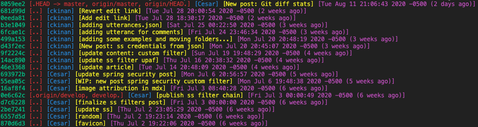

My Cheat Sheet for: Git Commands (it's supposed to (slowly) grow)

## git log

Git log with some styling (colors and specific order I like to see)
```bash
$ git log --pretty=format:"%C(Green)%h %C(Red)[.%D.] %C(Blue)[%an] %C(Yellow)[%s] %C(Magenta)[%ad (%ar)]"
```


## git diff

Get number of files changed, lines inserted and lines removed between two branches or commits
```bash
$ git diff --shortstat master..develop
 13 files changed, 90 insertions(+), 410 deletions(-)

$ git diff --shortstat 499a153..8059ee2
 3 files changed, 69 insertions(+), 1 deletion(-)
```

## git stash

Stash your changes quickly

```bash
$ git stash
```

Stash your changes with a custom message:

```bash
$ git stash push -m "your message here"
```

See your stash entries

```bash
$ git stash list
stash@{0}: On main: your message here
```

See the diff of a given stash entry

```diff
$ git stash show -p stash@{0}
diff --git a/blog/cheat-sheet-git-commands/index.mdx b/blog/cheat-sheet-git-commands/index.mdx
index 0a038ac..6134c05 100644
--- a/blog/cheat-sheet-git-commands/index.mdx
+++ b/blog/cheat-sheet-git-commands/index.mdx
@@ -6,12 +6,16 @@ slug: cheat-sheet-git-commands
:
(more)
```

Save stash diff on disk

```bash
$ git stash show -p stash@{0} > ~/your_diff.patch
```

Apply stash to your current branch. Note: The stash will be removed from the stash store

```bash
$ git stash pop stash@{0}
```

Clean your stash entries

```bash
# Only one entry
$ git stash drop stash@{2}
# Delete all your stash entries
$ git stash clear
```