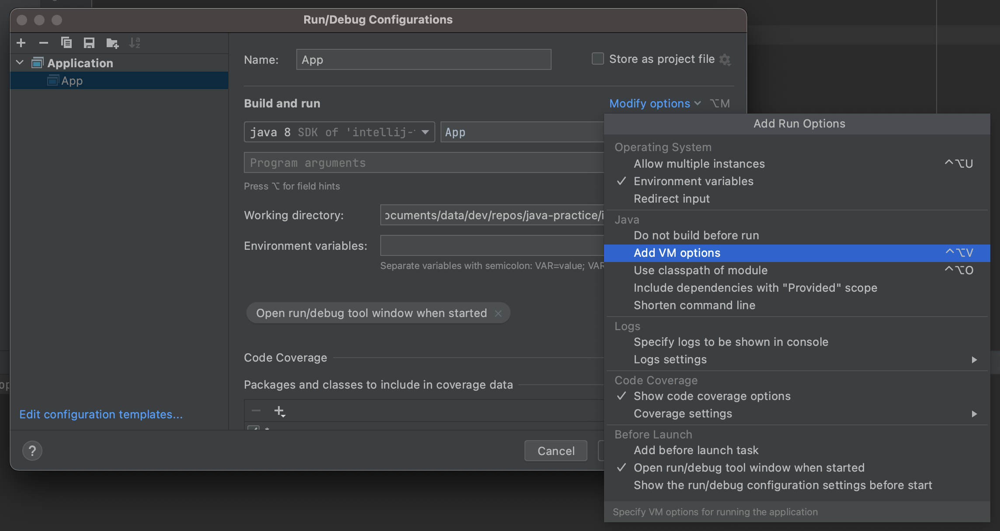
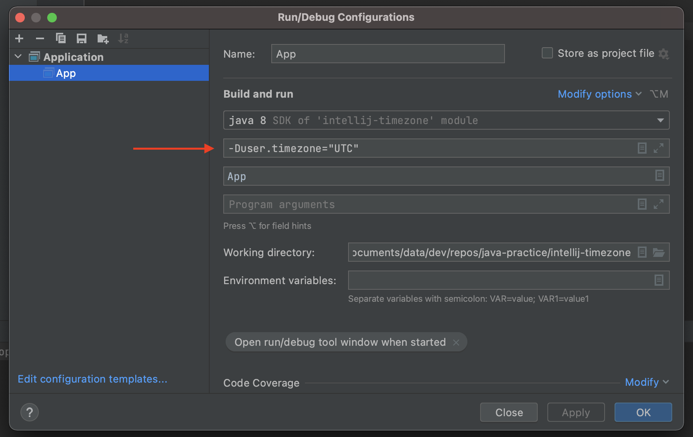

Quick note on how to set timezone in Intellij IDEA.

## Steps

- Step 1: Create a simple java project (`main()` method to just print the current date-time for testing)
- Step 2: Set timezone in Intellij (will set timezone via JVM options)

## Step 1: Create a simple java project

- Create a Java project with only one single java class called `App.java`.
- Create its method main to be executable
- Print the current date and time in console

```java
import java.util.Date;

public class App {

    public static void main(String[] args) {
        System.out.println(new Date());
    }

}
```

Run the app (right click on the class > Run App.main), current date and time reflects my timezone in the console (Peru in my case):

```
Fri May 28 16:38:08 PET 2021
```

## Step 2: Set timezone in Intellij

- Open Run/Debug Configurations and click on Add VM options



- Under VM options, type the timezone you want. Example: `-Duser.timezone="UTC"` if you want UTC.



- Run the application again, current date and time should now reflect UTC in the console:

```
Fri May 28 21:43:39 UTC 2021
```

## Notes

Tested with:
- Intellij IDEA v2021.1.1
- Java 8