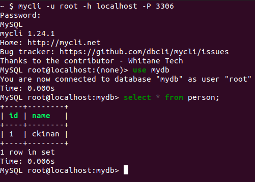

Quick note on how to connect to MySQL via terminal.

First option, I went to MySQL docs, found `mysql` command can be installed from here: [https://dev.mysql.com/downloads/mysql/](https://dev.mysql.com/downloads/mysql/).
The only "problem" with that is it would also install a MySQL Server in my machine, and I just wanted to have the client.

Found [mycli](https://www.mycli.net/):

> A command line client for MySQL that can do auto-completion and syntax highlighting.

Followed the installation instructions, and.. connected!

## Notes

Tested on:
- Ubuntu 20.04.2 LTS
- Python 3.8.5