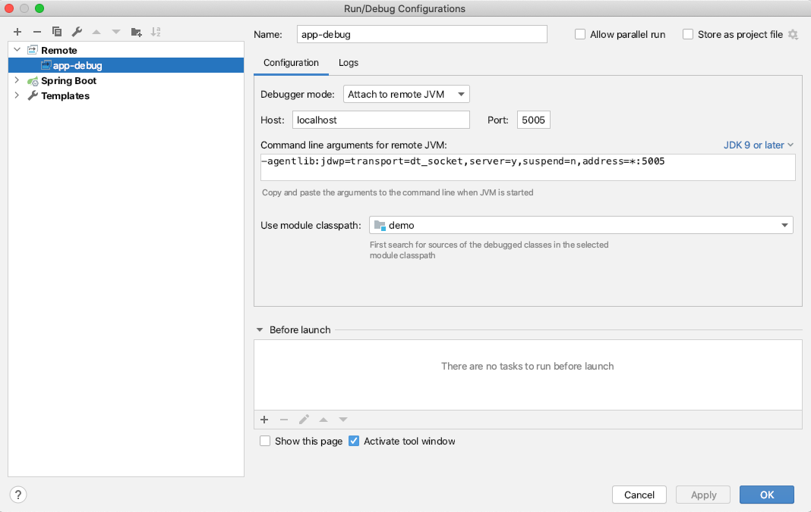
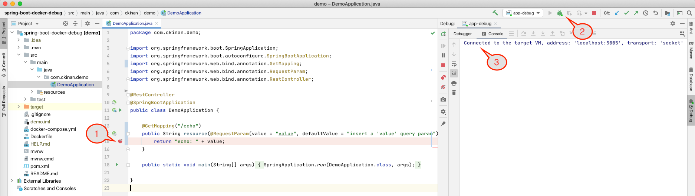
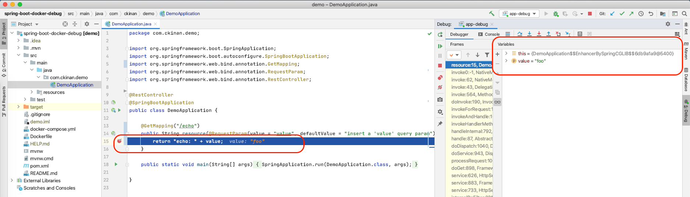

I had to setup a local environment for a Spring Boot application running in a Docker container. Naturally, I needed to find a way to debug my app, which is the step I want to explain here.

## Prerequisites

- IntelliJ IDEA
- Docker

## Scope

- We will have only one (GET) endpoint that receives a "value" as string parameter and return that back to the client.
- We want to put a breakpoint in the controller to demonstrate the debug configuration is working properly.
- We don't want more logic in our code as the goal is to get our debug config ready in this local/docker/springboot environment.

## Create the project

Generate and [Download](https://start.spring.io/#!type=maven-project&language=java&platformVersion=2.3.3.RELEASE&packaging=jar&jvmVersion=14&groupId=com.ckinan&artifactId=demo&name=demo&description=Demo%20project%20for%20Spring%20Boot&packageName=com.ckinan.demo&dependencies=web) a Spring Boot project with only "Spring Web" as a dependency.

Open the project in IntelliJ.

## Create the resource controller

Open the `DemoApplication` class and create a resource controller, in this example mapped with alias `/echo`, that is simply going to return the value from the request.

```java
package com.ckinan.demo;

import org.springframework.boot.SpringApplication;
import org.springframework.boot.autoconfigure.SpringBootApplication;
import org.springframework.web.bind.annotation.GetMapping;
import org.springframework.web.bind.annotation.RequestParam;
import org.springframework.web.bind.annotation.RestController;

@RestController
@SpringBootApplication
public class DemoApplication {

	@GetMapping("/echo")
	public String resource(@RequestParam(value = "value", defaultValue = "insert a 'value' query param") String value) {
		return "echo: " + value;
	}

	public static void main(String[] args) {
		SpringApplication.run(DemoApplication.class, args);
	}

}
```

## Package your app

Execute the following command manually to get the `jar` file of your project generated using maven.

```
./mvnw package
```

You should have the `jar` file created in the `./target` folder. In this example, it should be under the name `./target/demo-0.0.1-SNAPSHOT.jar`

## Create the Dockerfile

Create a `Dockerfile` in the root of the project.

```
FROM openjdk:14-jdk-alpine
ARG JAR_FILE=target/*.jar
COPY ${JAR_FILE} app.jar
ENTRYPOINT ["java","-jar","/app.jar"]
```

We are giving the instruction to Docker to build an image from `openjdk:14-jdk-alpine` and copy our recently created `jar` file that will be used in our container.

## Build the image

Run the `docker build` command to create the Docker Image.

```
docker build -t ckina/demo-spring-boot-docker-debug .
```

The image will be created with the repository name `ckina/demo-spring-boot-docker-debug`, change that if you want.

## Remote debug your container

Choose one of the following ways to run your docker container: with `docker run` or `docker-compose`.

### With docker run

Execute the `docker run` command using the Docker Image we've just created.

```
docker run --name demo-spring-boot-docker-debug -e "JAVA_TOOL_OPTIONS=-agentlib:jdwp=transport=dt_socket,server=y,suspend=n,address=*:5005" -p 8080:8080 -p 5005:5005 ckina/demo-spring-boot-docker-debug
```

### With docker-compose

Create a `docker-compose.yml` file and execute `docker-compose`.

```yml
version: '3.3'

services:
  spring-boot:
    container_name: demo-spring-boot-docker-debug
    build: .
    ports:
      - '8080:8080'
      - '5005:5005'
    environment:
      - JAVA_TOOL_OPTIONS=-agentlib:jdwp=transport=dt_socket,server=y,suspend=n,address=*:5005
```

Options:
- `--name`: We are naming our container as `demo-spring-boot-docker-debug`, which can be changed as needed.
- `-p 8080:8080`: Expose our Spring Boot application outside the docker container
- `-p 5005:5005`: Expose the port that will be used to connect our IDE with the application to do the remote debug
- `-e`: Set environment variables, in this case, we want to use the `-agentlib:jdwp` option for debugging. (We will see more details of it later)

Run:

```
docker-compose up --build
```

Verify your endpoint is working by opening this in a browser: [http://localhost:8080/echo?value=foo](http://localhost:8080/echo?value=foo)

It should give you `echo: foo` in the response of the call.

## Create the remote debug configuration in IntelliJ and attach the debugger

Go to `Edit Configurations` and create a `Remote` config:



Note: It's important to have the command line arguments matching with our configuration we introduced into our docker container. In this case this is what should match:

```
-agentlib:jdwp=transport=dt_socket,server=y,suspend=n,address=*:5005
```

Go back to your IDE and do the following:



1. Set a breakpoint in your controller, right in the line where the string value is returned
2. Click on the debug button
3. You should have your IDE connected as the debugger of your Spring Boot application

Now execute one more time [http://localhost:8080/echo?value=foo](http://localhost:8080/echo?value=foo)

The breakpoint in the IDE should be activated. We are done.



## Details on the command line argument for the Remote Debug

Here we have the details about the `-agentlib:jdwp` option we introduced in the environment variables of our docker container:

- Format: `-agentlib:jdwp=<name1>[=<value1>],<name2>[=<value2>]...`
- `transport=dt_socket`: The way you want to connect the debug. It can be done through Socket Transport or Shared Memory Transport. In this example we're using the Socket Transport.
- `server=y`: We want to have our application listening to the debugger to be attached, in this case the debugger will be the IDE.
- `suspend=n`: We don't want to wait until the debugger is attacher to completely start the Spring Boot application.
- `address=*:5005`: Listen for a socket connection on port 5005, which is the port number we want to configure in our IDE.

More details about the `-agentlib:jdwp` option: [https://docs.oracle.com/en/java/javase/14/docs/specs/jpda/conninv.html](https://docs.oracle.com/en/java/javase/14/docs/specs/jpda/conninv.html)

## Links

- Repo: [https://github.com/ckinan/java-practice/tree/master/spring-boot-docker-debug](https://github.com/ckinan/java-practice/tree/master/spring-boot-docker-debug)
- Spring Boot example (some pieces of this example is based on what Spring Boot has in its docs): [https://spring.io/guides/gs/spring-boot-docker/](https://spring.io/guides/gs/spring-boot-docker/)
- Docs for the `-agentlib:jdwp` option: [https://docs.oracle.com/en/java/javase/14/docs/specs/jpda/conninv.html](https://docs.oracle.com/en/java/javase/14/docs/specs/jpda/conninv.html)
