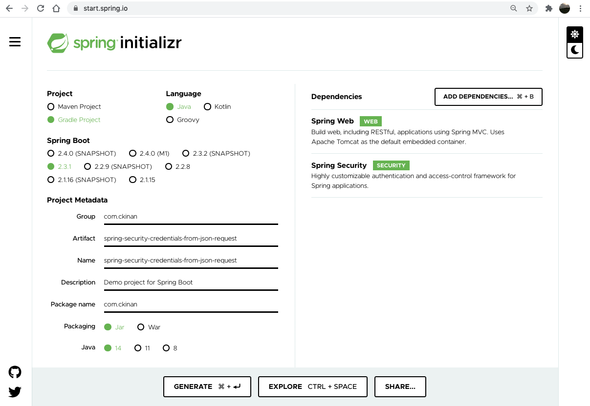
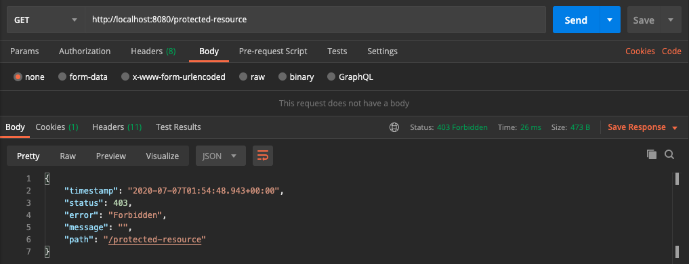
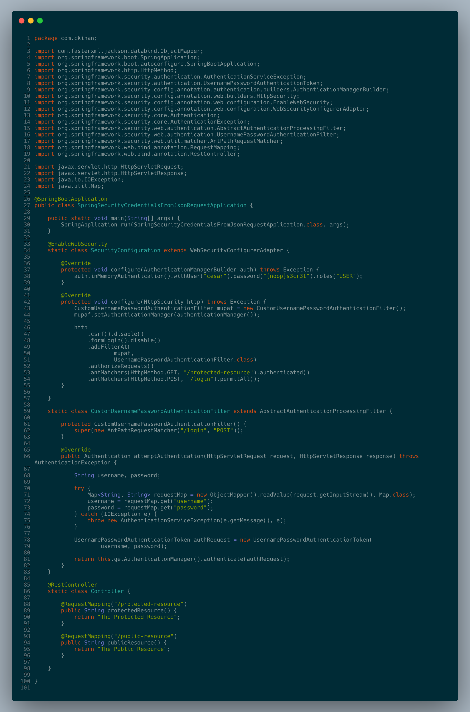

One more example of how flexible Spring Security is. This time, we will take a look at how we can override the default behavior to read credentials from any requests to start working with JSON format and authenticate users based on that.

## Introduction

Once you include the Spring Security dependency into your project, it gives you a lot of features out of the box. A pre-defined login form is one of them, for any protected resource without an authenticated user, the application would automatically redirect you to a Login Page (a form). Any form submission is sent to the endpoint `/login` (method POST) and the filter chain of Spring Security takes action. It extracts the username and password parameters from the request and use them to perform the authentication process.

That is the default behavior coming from Spring Security. In the class `UsernamePasswordAuthenticationFilter`, it has a method called `attemptAuthentication`, which receives two parameters: a request and a response (`HttpServletRequest` and `HttpServletResponse`). This class is part of the filter chain (by default), and if there is a login form submission, then the request will pass through there.

But what if we don't want to send the credentials in a form submission, and our use case requires an endpoint that allows clients to authenticate users by sending their credentials within a JSON body. In that case, the default filter won't support that format. The filter will look at the request-parameters and will try to find the `username` and the `password` params names. In fact, it is very explicit in the docstrings of the `UsernamePasswordAuthenticationFilter` class:

> Login forms must present two parameters to this filter: a username and password.

Here I will explain one way to get credentials from a JSON request and continue with the rest of the security filter chain.

## Scope

- Create a custom filter to read the credentials from the request in a JSON format and include it in the security filter chain in replacement of the `UsernamePasswordAuthenticationFilter`
- No UI. Everything will be tested via Postman
- Set users details in memory

## Pre-requisites

- Java 8 or higher
- IDE of your preference (Intellij Idea, Eclipse, etc)

## Create project

Go to http://start.spring.io and generate a new project. These are the key pieces for this code example:

- Project: Gradle
- Language: Java
- Dependencies: Spring Web, Spring Security

You can use this direct link with all the configuration already set: [link](https://start.spring.io/#!type=gradle-project&language=java&platformVersion=2.3.1.RELEASE&packaging=jar&jvmVersion=14&groupId=com.ckinan&artifactId=spring-security-credentials-from-json-request&name=spring-security-credentials-from-json-request&description=Spring%20Security%20-%20Credentials%20from%20JSON%20request&packageName=com.ckinan&dependencies=web,security)

## Create the components

In the project we've just downloaded, let's create the following classes under the main package (`com.ckinan` in my case):

- `Application`: It comes from the zip file we've just downloaded. It will start the Spring Boot application for us. No changes required here
- `Controller`: Two "resources" will be exposed in this controller: A protected resource and a public resource (names are self-explanatory)
- `SecurityConfiguration`: Contains our security configuration and we will provide the in-memory user to the `AuthenticationManager` by using its configurer
- `CustomFilter`: Replacement of `UsernamePasswordAuthenticationFilter` in the filter chain. It will read the credentials from the JSON payload coming within the `HttpServletRequest`

### Project Structure



## Review the components

### Controller

```java
package com.ckinan;

import org.springframework.web.bind.annotation.RequestMapping;
import org.springframework.web.bind.annotation.RestController;

@RestController
public class Controller {

    @RequestMapping("/protected-resource")
    public String protectedResource() {
        return "The Protected Resource";
    }

    @RequestMapping("/public-resource")
    public String publicResource() {
        return "The Public Resource";
    }

}
```

Includes two endpoints (both `GET` method) that basically return some string values:

- `/protected-resource`: This endpoint will be protected by our Spring Security configuration. By "protected", it means clients need to authenticate first to access the resource.
- `/public-resource`: Authentication is not needed to access this resource.

> Note: Later we will define the security restrictions for both endpoints in `SecurityConfiguration` class.

### CustomFilter

```java
package com.ckinan;

import com.fasterxml.jackson.databind.ObjectMapper;
import org.springframework.security.authentication.AuthenticationServiceException;
import org.springframework.security.authentication.UsernamePasswordAuthenticationToken;
import org.springframework.security.core.Authentication;
import org.springframework.security.core.AuthenticationException;
import org.springframework.security.web.authentication.AbstractAuthenticationProcessingFilter;
import org.springframework.security.web.util.matcher.AntPathRequestMatcher;

import javax.servlet.http.HttpServletRequest;
import javax.servlet.http.HttpServletResponse;
import java.io.IOException;
import java.util.Map;

public class CustomFilter extends AbstractAuthenticationProcessingFilter {

    protected CustomFilter() {
        super(new AntPathRequestMatcher("/login", "POST"));
    }

    @Override
    public Authentication attemptAuthentication(
            HttpServletRequest request, HttpServletResponse response) throws AuthenticationException {

        String username, password;

        try {
            Map<String, String> requestMap = new ObjectMapper().readValue(request.getInputStream(), Map.class);
            username = requestMap.get("username");
            password = requestMap.get("password");
        } catch (IOException e) {
            throw new AuthenticationServiceException(e.getMessage(), e);
        }

        UsernamePasswordAuthenticationToken authRequest = new UsernamePasswordAuthenticationToken(
                username, password);

        return this.getAuthenticationManager().authenticate(authRequest);
    }

}
```

This filter is the one in charge of reading the credentials from the request in JSON format. It will act as replacement of the `UsernamePasswordAuthenticationFilter`, which we are removing from our spring security configuration in favor of the new `CustomFilter`.

The constructor is passing an `AntPathRequestMatcher` object with two params:

- `pattern`: Any request coming from the `/login` path will be considered by this filter to perform the authentication process. It could be anything that matches your needs as API pattern or path, for example: `/api/login` or `/sign-in` or whatever
- `httpMethod`: We want to process any request as `POST` method

We are also overriding the method `attemptAuthentication`, which is going to extract the `username` and `password` from the request JSON payload. There are certainly multiple ways to extract the JSON values and assign them into java objects, but for now, I'm using `ObjectMapper` and assigning the values to a `Map`. Later they will be assigned to their corresponding `String` variables.

Once we get the credentials, we need to perform the `authenticate` process, which is provided by the `AuthenticationManager`. Quoting from the docs https://spring.io/guides/topicals/spring-security-architecture :

> Spring Boot provides a default global AuthenticationManager (with just one user) unless you pre-empt it by providing your own bean of type AuthenticationManager. The default is secure enough on its own for you not to have to worry about it much, unless you actively need a custom global AuthenticationManager. If you do any configuration that builds an AuthenticationManager you can often do it locally to the resources that you are protecting and not worry about the global default.

In this example, we are configuring our in-memory user (see later in our `SecurityConfiguration` class) into the `AuthenticationManager`. So any `username` and `password` from a JSON payload will be verified against the in-memory user we have there. I think this is the _meat_ of this example.

For that to happen, the method `authenticate` of the `AuthenticationManager` receives a token, which in this case we are initializing a `UsernamePasswordAuthenticationToken` with the credetials coming from the request.

One important note on this, if you visit the `UsernamePasswordAuthenticationFilter` class (from the codebase of Spring Security), you will notice that I'm trying to mimic the logic in its `attemptAuthentication` method, which by default it gets the credentials coming as form parameters ([link](https://github.com/spring-projects/spring-security/blob/97ccbe5df20c1f9999784d2d0d84d159965bdaca/web/src/main/java/org/springframework/security/web/authentication/UsernamePasswordAuthenticationFilter.java#L76-L103))

### SecurityConfiguration

```java
package com.ckinan;

import org.springframework.http.HttpMethod;
import org.springframework.security.config.annotation.authentication.builders.AuthenticationManagerBuilder;
import org.springframework.security.config.annotation.web.builders.HttpSecurity;
import org.springframework.security.config.annotation.web.configuration.EnableWebSecurity;
import org.springframework.security.config.annotation.web.configuration.WebSecurityConfigurerAdapter;
import org.springframework.security.web.authentication.UsernamePasswordAuthenticationFilter;

@EnableWebSecurity
public class SecurityConfiguration extends WebSecurityConfigurerAdapter {

    @Override
    protected void configure(AuthenticationManagerBuilder auth) throws Exception {
        auth.inMemoryAuthentication().withUser("cesar").password("{noop}s3cr3t").roles("USER");
    }

    @Override
    protected void configure(HttpSecurity http) throws Exception {
        CustomFilter mupaf = new CustomFilter();
        mupaf.setAuthenticationManager(authenticationManager());

        http
            .csrf().disable()
            .addFilterAt(
                    mupaf,
                    UsernamePasswordAuthenticationFilter.class)
            .authorizeRequests()
            .antMatchers(HttpMethod.GET, "/protected-resource").authenticated()
            .antMatchers(HttpMethod.POST, "/login").permitAll();
    }

}
```

For simplicity, here we are working with only one user loaded from memory:

- Username: `cesar`
- Password: `s3cr3t`

The `{noop}` means we are going to use the `NoOpPasswordEncoder` password encoder, which simply does not do anything to the password we are providing `s3cr3t` (it won't get encoded). This is not secure obviously, but will work for this example.

The `AuthenticationManagerBuilder` will allow us to configure the above in-memory user into the `AuthenticationManager`. So that any request that passes through the `CustomFilter`, will try to "authenticate" the incoming credentials against this user details manager.

Creates new instance of the `CustomFilter`, in which we want to provide the `authenticationManager` we should already have configured at this point. Then insert the filter in the same position as the `UsernamePasswordAuthenticationFilter` would have been.

Then, configure the `antMatchers` for the two resources (one public one protected).

> Note: I need another space to explore the `csrf` configuration. For now, we need to disable the feature, otherwise requests won't get until the `CustomFilter` within the filter chain

## Run and test

Run the application with the following instruction in terminal (need to cd to the project directory):

```
$ ./gradlew bootRun
```

Testing with Postman, it will fail trying to access the `protected-resource` because the user is not authenticated (yet)



Use the `/login` endpoint to authenticate the user. The `Not Found` error from the response refers to the `/` resource which we simply don't have in our controller. Remember we only have set two endpoints: `protected-resource` and `public-resource`.



Now, try to access the `protected-resource` once again. This time, the user should be already authenticated.


At any point of time, with or without a successful authentication, the `public-resource` should be accessible.


## Final thoughts

- During this example, I noticed there is another area to explore: how AuthenticationManager, ProviderManager and AuthenticationProvider are connected all together to allow the application setup a custom authentication process.
- Nothing prevents us to customize the way we extract credentials from the requests. And one more time, it proves the flexibility of Spring Security to do some work like that. All I did was to mimic what `UsernamePasswordAuthenticationFilter` does to capture the username and password from a `HttpServletRequest` object.
- It's pretty important to be aware of the filters that Spring Security provides. There is a comprehensive list of filters in this [link](https://docs.spring.io/spring-security/site/docs/current/reference/html5/#servlet-security-filters). So if there is another behavior we want to customize in regards of what is happening in the filter chain, then we need to know where exactly (and how) that should happen. A breakpoint in `FilterChainProxy` is a good point to start.

## Links

- Github repo: https://github.com/ckinan/java-practice/tree/master/spring-security-credentials-from-json-request
- Spring Security Architecture (gave me more insights about what AuthenticationManager, ProviderManager and AuthenticationProvider are): https://spring.io/guides/topicals/spring-security-architecture
