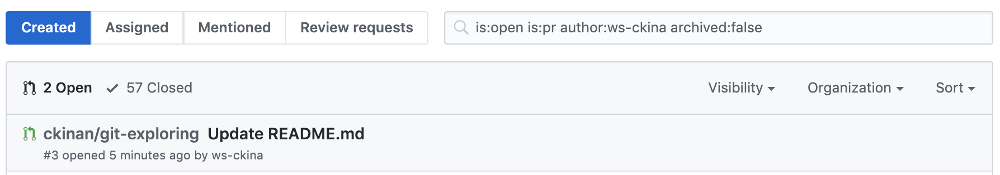

How I built a pull request viewer using Github API. What I learned and what I failed.

## Introduction

I am maintaining a software that its repo is in Github. That means, I had to get familiar with the tools this platform provides. Code Reviews with Pull Request, which is one of the features Github has, where you can interact with who owns the code changes before merging a branch into master.

As a reviewer, I have to open pull requests regularly to do my review. Meaning, more than likely I have to visit https://github.com/pulls frequently to see whichh PRs I have in my queue.

After some time seeing my list of PRs, I noticed there are cases where I would like to see more information in that list before clicking on one of those. Like for example, the number of approvals each PR already have, or if there is already activity such comments, requested changes, and who did which action, so with all these information in that same list I can have a clearer idea what's going on there. Yeah, I know it's only one click away from seeing all of that, but as I was about to study the Github API, I decided to give it a try.

Before going to the details, I want to start showing two images that somewhat explains what is this all about.

Official Github Pull Requests View looks like this:

My clone looks like this:

## Expectations

### The need

A different way to see the list of pull requests that could give me a better visibility of which code reviews I have in my queue and need my attention.

### The approach

Make use of Github API to read my pull requests based on my username and show valuable information within a web application.

### The (minimum) value

At least, I wanted to have:

1. Last updated date-time
2. Counts for current reviewer who: approved, requested changes, commented, awaiting within each pull request
3. Events in a timeline

There are some more "features" I included in this project for different reasons, like Authentication (for obvious reasons), a search form, and some basic filtering functionality.

## The Jorney

### The Stack

It was the time to choose the stack and tools to develop this web application. Here is the summary of what I got and why:

| The Stack                                                                     | The Why                                                                                                                                                                                                                                                                                                                                                                                                                                                                                                                                       |
| ----------------------------------------------------------------------------- | --------------------------------------------------------------------------------------------------------------------------------------------------------------------------------------------------------------------------------------------------------------------------------------------------------------------------------------------------------------------------------------------------------------------------------------------------------------------------------------------------------------------------------------------- |
| [ReactJS](https://reactjs.org/)                                               | I am not a frontend guy, but I had some little projects (mostly TODO apps) that I had built previously and this time I wanted to create something "more elaborated" and get a better understanding of the basics.                                                                                                                                                                                                                                                                                                                             |
| [Github API](https://developer.github.com/v3)                                 | A must if I wanted to read data from Github                                                                                                                                                                                                                                                                                                                                                                                                                                                                                                   |
| [Netlify Functions](https://www.netlify.com/products/functions/) (Javascript) | I needed a backend service to hide the Secret Key to make calls to Github API. I was not sure which service and programming language to choose. My first option was to create a Java or NodeJS service and deploy it on Heroku, but I didn't want to pay for this to be "live" forever (no sleep time). I wanted this to be totally free. That is why I decided to go with Netlify Functions, which doesn't have that kind of restrictions and it's free, at least for this small project that won't have too much calls, I said "it's good". |
| [Primer CSS](https://primer.style/css/)                                       | I didn't want to spend time styling this web application. I literally just googled "github css styles" and found this cool thing that saved me a lot of time.                                                                                                                                                                                                                                                                                                                                                                                 |

### The process

#### 1. Github API (Preliminary Research)

First of all, I had to do some research about how to consume Github API, there are some previous articles I posted about it:

- [Github API First glance](https://www.ckinan.com/2020/2/7/github-api)
- [Github API OAuth tokens for apps](https://www.ckinan.com/2020/3/13/github-api-oauth-app)

By doing that, I was able to confirm if what I wanted to do was possible. Meaning: Reading Pull Requests from the API was viable.

#### 2. Create the frontend

I was surprised how easy is to create a brand new web application and get it running. The `create-react-app` CLI was my guy and made me forget all my setup problems I had some time ago while following some tutorials that are well explained but I guess I am not that smart.

#### 3. Create the backend

I had some reads about how use Netlify Functions to accomplish specific goals:

- Goal #1: How to use Environment Variables. This is actually the most important one, because I wanted to have the Github Secret Key hidden in one of these Variables.
- Goal #2: How to use its "develop mode". Ref: https://www.netlify.com/products/dev/
- Goal #3: How to handle cookies (my limited knowledge about secury led me to simply pass tokens using a cookie).

#### 4. Connect the front with the back

It was the most interesting part. From here I learned few things:

**A) GraphQL**

This is the best thing I've discovered within this project. The first version of this project was to use the Github API v3, whis expose the endpoints with REST.

The only one thing that made me switch to v4 (GraphQL) was the number of requests I had to make to get Pull Requests information. Why is that? Because every time I wanted the list of pull requests and their details I had to make a Request to the endpoint to fetch the users, then the repos, then the pull requests, then the reviews, and so on. Nested loops everywhere, without mentioning that the JSON responses had data that I didn't even need.

With GraphQL, I only had to be worried about one single endpoint and try my queries I previously tested within the [GraphQL Explorer](https://developer.github.com/v4/guides/using-the-explorer/).

After switching to GraphQL I finally got the idea of using it, and I am pretty sure there are pros and cons about it, but at least for this project, it was a must.

**B) I do know nothing about security**

While developing the interface of my Netlify Functions, I was thinking how to prevent users from executing my APIs without any permissions. There were a lot of techniques and approaches I was not able to understand. I had to apply maybe one of the easiest ways to avoid being attacked by something from the client side. My method was basically the use of cookies to store the token after being authenticated.

I also developed two ways to be "authenticated" and consume the API:

- Method #1: Authorizing OAuth Apps. Ref: https://developer.github.com/apps/building-oauth-apps/authorizing-oauth-apps/
- Method #2: Store a Personal Access Token as Environment Variable. (Only meant to be used locally)

~~I believe this is the main reason I can't get this project deployed in the cloud, because I can't figure this thing out yet...~~ . UPDATE: Deployed on Netlify: https://gh-pr-viewer.netlify.app/

#### 5. Test

After having the minimum things already developed, I forced myself to move from the official Github PRs view to my start using my application. It was a good move, I mean, things were going well, I had the information I originally said I need, few bugs but working.

During this stage, I had to refactor several parts of the code. Here I learned a little more about React Hooks, React Router, TypeScript and got used to this ecosystem more than I initially expected. I know I am not in the position to say I am now a "React" guy, but good enough to connect pieces and understand what's going on with the components and data state flows. However, I can't say "I know React", because I am pretty sure the code of this app has a lot of "spaghetti" and it's not using React in the right way.

## Reality

So far so good. I have a web application, running in my local machine, reading pull requests information directly from the API. I actually use this daily to see what I have in my queue to do code review.

However, I don't think I accomplished my original need: "Better visibility of my code reviews". I have a web application that just show me things in a "different way", but doesn't make any difference in comparison with the official view from Github.

## Final thoughts

In terms of "learnings", I gained a lot from this project, because I was able to get some ReactJS skills, discovered one of the advantages of using GraphQL, and made some things with Serverless Functions (Netlify). But in terms of "solving my needs", I think I failed, because it is irrelevant which view use (the Github one or mine), this app doesn't make any difference at least in the current state.

Using something you are creating in your daily basis speeds up the development, because you realize what are the things you need to do immmediately or features you want to have or the bugs you need to fix, it's like you are your own client, which keeps you motivated.

Moving forward, I'll be still making more updates to this project, but for now, I don't think this is going to be as regular as it was the past weeks.

## Links

- Repo: https://github.com/ckinan/gh-pr-viewer
- Netlify instance: https://gh-pr-viewer.netlify.app/
