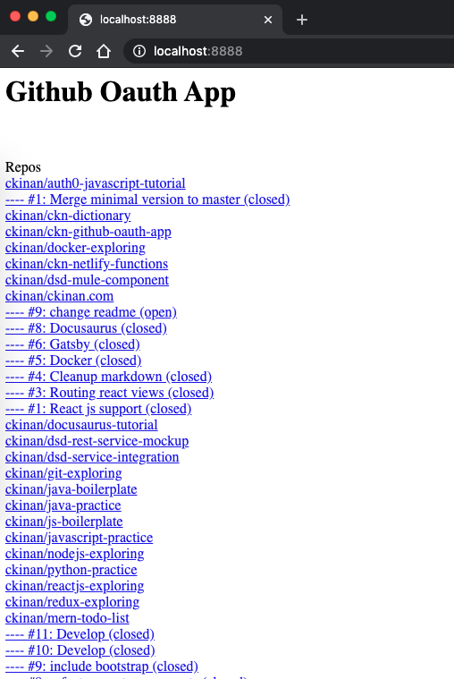

How to use OAuth tokens for apps with Github API to authorize the access of certain data on behalf of the logged in user.

## Github Web flow

Quoting Github docs:

> Tokens should be created via a [web flow](https://developer.github.com/apps/building-oauth-apps/authorizing-oauth-apps/). An application sends users to GitHub to log in. GitHub then presents a dialog indicating the name of the app, as well as the level of access the app has once it's authorized by the user. After a user authorizes access, GitHub redirects the user back to the application.

Note: I am going to use what they call "web flow" because seems to be the recommended method and some other methods will be deprecated by the end of this year: https://developer.github.com/changes/2020-02-14-deprecating-oauth-auth-endpoint/

## Example (Step by step)

In this example, I will write a simple web application that displays the list of all public repos and all their pull request of a user by following three steps.

Summary:

1. Authenticate Github API via [web flow](https://developer.github.com/apps/building-oauth-apps/authorizing-oauth-apps/)
2. Get repos of the authenticated user
3. Get pull requests per each repo


Details:

1. Authenticate Github API via [web flow](https://developer.github.com/apps/building-oauth-apps/authorizing-oauth-apps/)

Follow these steps to create an oauth app: https://developer.github.com/apps/building-oauth-apps/creating-an-oauth-app/
More information about oauth apps: https://developer.github.com/apps/building-oauth-apps/authorizing-oauth-apps/

In this example, this is the information I have:

- Application name: OAuth App Local
- Homepage URL: http://localhost:8888
- Application description: Just left in blank
- Authorization callback URL: http://localhost:8888

Then I created a simple `index.html` file with a single link that points to `https://github.com/login/oauth/authorize?scope=user:email,read:org&client_id=<CLIENT_ID>` . Notice `<CLIENT_ID>` in the URL is the client id that Github gives you when you create your OAuth App. This can be in your public code. However, later in this article we will use also the `Client Secret`, this SHOULD BE totally hidden from public access, meaning: it MUST BE in your backend layer.

> Note: We are asking for the following "permissions": `user:email` and `read:org`. Ref: https://developer.github.com/apps/building-oauth-apps/understanding-scopes-for-oauth-apps/

Once the user is authenticated through Github Login Page, Github will redirect to the "callback URL" including a `code` as query param like: `http://localhost:8888?code=xxxxxx`. This `code` will be used to make another call to get the access code.

The public site makes a call to the Netlify Function located in the same project under the path `/.netlify/functions/github-client?code=<CODE>`. Where `<CODE>` is what Github had sent to the callback url in the previous step.

The Netlify Function will make a call to `https://github.com/login/oauth/access_token` sending:

- Client Secret (Environment Variable)
- Client ID (Environment Variable)
- Code (Query Param)

> Note: For more information about Netlify Functions, read this: https://ckinan.com/blog/2020/03/07/netlify-functions

Once you get the token from the endpoint above, then you will be able to make calls to any Github API that your token has access, in this case, we asked for the following scopes: `user:email` and `read:org` and all public scopes that don't need to be specified for authorization.

2. Get repos of the authenticated user through `GET /user/repos` endpoint . Ref: https://developer.github.com/v3/repos/#list-repositories-for-the-authenticated-user

Now that we have available the access token, we can make calls from the Front End to the Github API.

```js
const showRepos = async () => {
  fetch("https://api.github.com/user/repos", {
    method: "GET",
    headers: {
      Authorization: "Bearer " + localStorage.getItem(GH_ACCESS_TOKEN_KEY),
    },
  })
    .then(function (response) {
      return response.json()
    })
    .then(function (data) {
      document.getElementById("result").innerHTML += "<br/><br/>Repos"
      data.forEach(function (repo, index) {
        showReview(repo)
      })
    })
}
```

3. Get pull requests per each repo retrieved from previous step through `GET /repos/:owner/:repo/pulls` endpoint. Ref: https://developer.github.com/v3/pulls/#list-pull-requests

```js
const showReview = async repo => {
  fetch("https://api.github.com/repos/" + repo.full_name + "/pulls?state=all", {
    method: "GET",
    headers: {
      Authorization: "Bearer " + localStorage.getItem(GH_ACCESS_TOKEN_KEY),
    },
  })
    .then(function (response) {
      return response.json()
    })
    .then(function (data) {
      document.getElementById("result").innerHTML +=
        '<br/><a href="' +
        repo.html_url +
        '" target="_blank">' +
        repo.full_name +
        "</a>"
      data.forEach(function (pr, index) {
        document.getElementById("result").innerHTML +=
          '<br/><a href="' +
          pr.html_url +
          '" target="_blank">---- #' +
          pr.number +
          ": " +
          pr.title +
          " (" +
          pr.state +
          ")" +
          "</a>"
      })
    })
}
```

## Test

Login through web flow:


Redirected to Github Login Page:


You need to authorize this app:


Final result:



## Final thoughts

I can see Github OAuth App web flow as standard way to authorize an app to read/write information on behalf of an authenticated user using an access tokens. Speaking particularly about Github, the only thing I am kind of dissapointed is the fact I can't read Organization's data without the permission of the owner, which make totally sense, but originally I thought it could be possible since I was able to access that kind of information via Personal Access Token, but seems like scope are pretty different and I should have read carefully the docs in the first place.

I would like to create a more elaborated app that can show more information about repos, pull requests and stats using what I've learned here.

Github repo: https://github.com/ckinan/ckn-github-oauth-app

## Refs

- https://developer.github.com/v3/guides/getting-started/#using-oauth-tokens-for-apps
- https://developer.github.com/v3/guides/basics-of-authentication/
- https://developer.github.com/apps/building-oauth-apps/authorizing-oauth-apps/
- https://developer.github.com/v3/repos/
- https://developer.github.com/v3/pulls/
