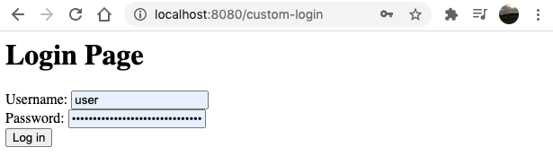

I am still in the process of learning more about Spring Security. This time I created a simple example that involves Form Login and Logout customizations.

## Scope
- Happy path: Public page -> Login Page -> Protected resource
- Non-happy path: Public page -> Login Page -> Login Error Page
- Ability to logout once the user is authenticated (it's on the Protected resource)
- Customize the urls for login and logout that come by default from Spring Security
- Create public and protected resources. This time, let's do some html (server side rendered)
- Create custom view to show whenever a login attempt fails
- Focus only in these two configurers: Form Login & Logout

## Out of scope
- Do not create custom users. Let's keep using the default user and password generated by Spring Security to avoid other distractions
- Do not concentrate in file/project structure, let's keep it simple in one single file

## Pre-requisites

- Java 8 or higher
- IDE of your preference (Intellij Idea, Eclipse, etc)

## Create project

Go to https://start.spring.io/ and add the following dependencies:

- Spring Web
- Spring Security
- Thymeleaf (we will create some html templates to render the views in server-side)


Generate, download and open the project in your IDE. I'll use Intellij IDEA.

## Create the components

In the project that we just downloaded, let's edit the `SpringSecurity02Application.java` file, which is our `SpringBootApplication`:

- Create a class `SecurityConfiguration`, which extends `WebSecurityConfigurerAdapter`. We will override the `configure(HttpSecurity)` method to setup our login and logout processes
- Create a class `Controller`, which will provide the endpoints for our views (login, logout, protected and public resources)

Then, under the `resources` folder of our application, in this case `spring-security-02/src/main/resources/templates`, let's create the four templates we want to render in our flow:

- login.html
- login-error.html
- protected-resource.html
- public-resource.html

The project structure should look like:


The above is all what we will create (in terms of files and classes). Now let's move to the details.

This is how our code should look like for the whole example (repo available on [Github](https://github.com/ckinan/java-practice/tree/master/spring-security-02)):


## Review the components

From the previous picture, let's take a look at each component and what each piece means.

**Block #1. The Form Login Setup**

- `formLogin()`: Let Spring Security know we want to support authentication through a login form
- `loginPage("/custom-login")`: Set the custom login url to GET the login form rendered and also to submit (POST) the form
- `usernameParameter("myUser")`: Specify the parameter name to get the username from the request
- `passwordParameter("myPass")`: Same than previous but for the password
- `defaultSuccessUrl("/protected-resource")`: URL that we want to be _redirected_ once it gets a successful login attempt
- `failureHandler(...)`: Provide a handler for any failed requests. This time, we want to configure a `SimpleUrlAuthenticationFailureHandler`, which is going to _redirect_ the user to the given url in the constructor, in this case it's `/login-error`

**Block #2. The Logout Setup**

- `logout()`: Allow our application to customize the login "default" setup
- `logoutUrl("/custom-logout")`: URL that will handle the logout process
- `logoutSuccessUrl("/")`: Similar to `defaultSuccessUrl`, but for the logout process. The url that we want to be _redirected_ once it gets a successful logout attempt

**Block #3. The controller**

The controller has four request handlers, all of them provide server-rendered views that will serve to our example to have the login authentication flow. Most of these views will work with the template engine [Thymeleaf](https://www.thymeleaf.org/doc/articles/springmvcaccessdata.html) to access data from the application's context.

- `/custom-login`: Serve the `login.html` view:

```html
spring-security-02/src/main/resources/templates/login.html

<html xmlns="http://www.w3.org/1999/xhtml" xmlns:th="https://www.thymeleaf.org">
<head>
    <title>Login Page</title>
</head>
<body>
<h1>Login Page</h1>
<form th:action="@{/custom-login}" method="post">
    <div>
        Username: <input type="text" name="myUser"/>
    </div>
    <div>
        Password: <input type="password" name="myPass"/>
    </div>
    <div>
        <input type="submit" value="Log in" />
    </div>
</form>
</body>
</html>
```

In this template:

1. Action `/custom-login` will send the content (POST) from the client (the browser) to the server (our application)
2. Username and password `<input>`'s names should match with the `usernameParameter(...)` and `passwordParameter(...)` we specified to the `formLogin()` setup

- `/login-error`: Serve the `login-error.html` view:

```html
spring-security-02/src/main/resources/templates/login-error.html

<html xmlns="http://www.w3.org/1999/xhtml" xmlns:th="https://www.thymeleaf.org">
<html>
<head>
    <title>Login Error Page</title>
</head>
<body>
<h1>Login Error Page</h1>
<p>Reason: <span th:text="${session.SPRING_SECURITY_LAST_EXCEPTION.message}"></span></p>
<p>Go to <a href="/custom-login">Login Page</a></p>
</body>
</html>
```

In this template:

1. Print the error message for any failed login attempt. The error message is coming from an exception thrown by Spring Security and added into the session attribute: `SPRING_SECURITY_LAST_EXCEPTION`
2. A link that redirects to the login page

> Note: Usually, we don't need a separate page just to inform that provided credentials are wrong. But I wanted to create this one for the sake of exploring this feature...

- `/protected-resource`: Serve the `protected-resource.html` view:

```html
spring-security-02/src/main/resources/templates/protected-resource.html

<html xmlns="http://www.w3.org/1999/xhtml" xmlns:th="https://www.thymeleaf.org">
<head>
    <title>Protected Resource</title>
</head>
<body>
<h1>Protected Resource</h1>
<p>Hey, I am a protected resource. Only authenticated users can see me.</p>
<form th:action="@{/custom-logout}" method="post">
    <div>
        <input type="submit" value="Logout" />
    </div>
</form>
</body>
</html>
```

In this template:

1. Points to the action `/custom-logout`. It should match with what we set in `logoutUrl(...)` during the `logout()` setup.
2. Notice the method for this form is `POST`. According to the documentation:

> If CSRF protection is enabled (default), then the request must also be a POST. This means that by default POST "/logout" is required to trigger a log out. If CSRF protection is disabled, then any HTTP method is allowed.

In our example, we didn't disabled the CSRF protection, so we want to do `POST`. More about CSRF: https://en.wikipedia.org/wiki/Cross-site_request_forgery

- `/`: Serve the `public-resource.html` view:

```html
<html>
<head>
    <title>Public Resource</title>
</head>
<body>
<h1>Public Resource</h1>
<p>Hey, I am a public resource. Anyone can see me.</p>
<p>Login to see protected resources. <a href="/custom-login">Login Page</a></p>
</body>
</html>
```

1. This view can be accessed without being authenticated. Remember that we only require authentication for the `protected-resource`, which we defined in our `SecurityConfiguration` class:

```java
    .authorizeRequests()
        .antMatchers(HttpMethod.GET, "/protected-resource").authenticated();
```

## Run and test

1. Run the application with the following instruction in terminal (need to `cd` to the project directory):

```bash
$ ./gradlew bootRun
```

2. Grab the auto-generated password from logs and wait until Spring Boot is fully initialized:

```
Using generated security password: 0c6fc7f8-34b1-4c04-a0f6-dbaa8eb8c21f
```

3. Open http://localhost:8080 in a browser


This is the public resource (no need to authenticate so far)

4. Click on the "Login Page" link and the Login Form should be rendered. Enter `user` as the username (defaulted by Spring Security) and the auto-generated password. Then click on "Log in" button



5. The protected resource should be displayed


6. If during login form credentials are invalid, then `login-error` view should be displayed


7. If user is not authenticated and tries to access `protected-resource` through the browser via http://localhost:8080/protected-resource , then the login page should be displayed. We didn't do anything but just telling Spring Security that resource needs authentication, then Spring Security is responsible of redirect the request to the Login Page

## Final Thoughts

From this example, I learned the following:

- The more I read about Spring Security, the more flexibility I find in there, which is awesome. The problem is that I (personally) learn by doing small things in the most isolated way. That is why I approached this post to only elaborate on Login and Logout very specific configurations. There are more features in those configurers that I didn't take, but at least this example helped me to know what to see, what to expect and where to look for help, which is something for the next point.
- Some pieces of code in this example where just copied from the Spring Security docstrings. For example:

https://docs.spring.io/spring-security/site/docs/current/api/org/springframework/security/config/annotation/web/configurers/FormLoginConfigurer.html#loginPage-java.lang.String-

In the above link, I found a `Example login.jsp`, which gave me a clear idea of what I have to have in `login.html`. I think Spring Security team makes a great job documenting their code.

- Found really useful navigate Spring Security codebase and check the classes hierarchies, method usages, stuff like that. I downloaded the [spring-security repo](https://github.com/spring-projects/spring-security) and do that exercise any time I needed to look further
- There are still some things I need to understand in the whole architecture of Spring Security. To me, how the request is redirected using the handlers is sort of mistery. I'd like to see how the filter chain works under the hood, and several other concepts I usually see when I google for something. I guess I'll figure them out when the time comes.

## Refs

- Github Repo: https://github.com/ckinan/java-practice/tree/master/spring-security-02
- Spring Security - Docs: https://docs.spring.io/spring-security/site/docs/current/api/overview-summary.html
- Thymeleaf - Access data: https://www.thymeleaf.org/doc/articles/springmvcaccessdata.html
