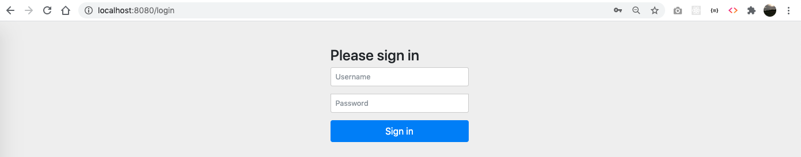
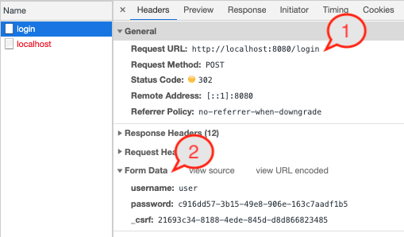
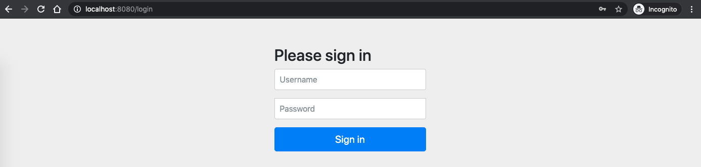

Getting started with Spring Security by doing a simple example to understand the basics.

## Pre-requisites

- Java 14 (not mandatory to have this version for this example)
- IDE of your preference (Intellij Idea, Eclipse, etc)

## Create project

Go to https://start.spring.io/ and add the following dependencies:

- Spring Web
- Spring Security


Click on the `GENERATE` button. A zip file should be downloaded. Unzip it and we are ready to start.

## Run the application

`cd` to the project directory, and execute the following:

```bash
$ ./mvnw spring-boot:run
```

Logs should look like:


1. Spring Security provides you a default password (for a default user) out of the box just by adding the Spring Security dependency. In the above screenshot, the password is `c916dd57-3b15-49e8-906e-163c7aadf1b5` for the user `user`.
2. The filter chain created for your requests. There are 15 filters in the chain added for you and in the order they are printed in the logs within the array. If you open a text editor and put all them in one line each, you should see something like:

```
org.springframework.security.web.context.request.async.WebAsyncManagerIntegrationFilter@f951a7f
org.springframework.security.web.context.SecurityContextPersistenceFilter@360bc645
org.springframework.security.web.header.HeaderWriterFilter@6cd5122d
org.springframework.security.web.csrf.CsrfFilter@3fe46690
org.springframework.security.web.authentication.logout.LogoutFilter@79fd6f95
org.springframework.security.web.authentication.UsernamePasswordAuthenticationFilter@6726cc69
org.springframework.security.web.authentication.ui.DefaultLoginPageGeneratingFilter@2241f05b
org.springframework.security.web.authentication.ui.DefaultLogoutPageGeneratingFilter@20cece0b
org.springframework.security.web.authentication.www.BasicAuthenticationFilter@5300cac
org.springframework.security.web.savedrequest.RequestCacheAwareFilter@5d51e129
org.springframework.security.web.servletapi.SecurityContextHolderAwareRequestFilter@109a2025
org.springframework.security.web.authentication.AnonymousAuthenticationFilter@4c777e7b
org.springframework.security.web.session.SessionManagementFilter@10c07b8d
org.springframework.security.web.access.ExceptionTranslationFilter@b16e202
org.springframework.security.web.access.intercept.FilterSecurityInterceptor@fd9ebde
```

Each of these have a purpose, and they make the whole flow of the security layer possible. Remember, they are filters chained that will take actions in that order whenever a new request comes.

3. The port that your application is running. In this case, it's in 8080.

- Create a rest controller
- Secure a REST API

## Open the application

Open http://localhost:8080 in your browser, a login page should be displayed:



By default and by just adding the Spring Security dependency to the project, it generates a login page that sends the credentials to a generated endpoint `/login` that is in charge of verify whether the username and password are valid for the application and give access to the protected resources.

Let's enter the credentials printed in logs into the form and click on the `Sign in` button (or just press enter).

- Username: `user`
- Password: `c916dd57-3b15-49e8-906e-163c7aadf1b5`

An error page is displayed:


This is expected. In order to understand what happened, let's go to the Network Tab in the Dev Tools.



1. The credentials were sent to the endpoint `login`. Spring Security created that for us for free and the request will be processed by the filter chain we saw in the logs earlier.
2. Information are sent from the pre-generated form. Notice the keys are already pre-defined `username`, `password` and a third one `_csrf`, which is meant to tackle the CSRF vulnerabilities. All them will be interpreted by the `login` endpoint.

So, why we get an error page if I utilized the correct credentials? Let's see the second record in the Network Tab.


1. The resource that was asked was: `http://localhost:8080/`. Think of it as it requested the `/` resource from `http://localhost:8080`.
2. 404 (not found). It means, the resource `/` doesn't exist.
3. The referer or who had initiated that request was `http://localhost:8080/login` which is the location where the credentials were sent through the form.

The error message refers to a resource that was not found. And that is because Spring Security only provides us the security stuff for the resources we want to protect. But, as we didn't touch anything in the codebase, actually we didn't even open the project in the IDE, then there is nothing to protect (yet) and the resource `/` (I suspect) is the default path right after a successful login is attempted.

One more thing to notice, in Application Tab there in the Dev Tools, there is a new Cookie created under the name `JSESSION`.


That is what keeps the already-logged-in user in session in the Spring Security context.

Finally, there are still more particulars working behind the scenes, in the following link there is a list what is happening to Spring Boot once the Spring Security dependency is included into the project.

Link: https://docs.spring.io/spring-security/site/docs/5.3.2.RELEASE/reference/html5/#servlet-hello-auto-configuration

A lot of things have happened by just adding the Spring Security dependency into the project. I didn't write any single line of code to get all the above stuff with Spring Security out of the box.

Now, let's go to the codebase and some documentation to understand where all these came from.

## The content of the project


The above is all what the project has. Actually, in https://start.spring.io/ , there is a button `EXPLORE` that you can see the content of the zip before downloading it. Well, as I didn't touch a thing, that project tree should be exactly the same as I downloaded (except for the auto-generated stuff of my IDE).

There are 3 key files that I'd like to mention so far:

1. `SpringSecurity01Application` is the class that initiates the application. In fact, this is not a Spring Security thing but from Spring Boot.
2. `mvnw`, this is the script that we utilized to run our application with the command `./mvnw spring-boot:run`. This is only one way to start the application, you can also run this by executing the generated `jar` after packaging the component with maven, maybe other techniques. For now, I'll keep continue using this method.
3. `pom.xml` registered two important dependencies:

```xml
<dependency>
    <groupId>org.springframework.boot</groupId>
    <artifactId>spring-boot-starter-security</artifactId>
</dependency>
<dependency>
    <groupId>org.springframework.boot</groupId>
    <artifactId>spring-boot-starter-web</artifactId>
</dependency>
```

The most relevant one is `spring-boot-starter-security`, which is giving us all the security features that we saw so far in this example. The other one `spring-boot-starter-web` is will enable the RESTful endpoints that are utilized in this example.

From here, there are a lot of features to incorporate into the project, and there are several ways to do the same thing. For now I'll do a simple exercise that will allow me to explain couple of more things.

## Securing a REST API

I'll write a very simple REST API that will just return a string value and have Spring Security protecting the endpoint.

### Create the Controller Class

Let's create two endpoints. One protected and one public.

```java
// ./Controller.java
package com.ckinan;

import org.springframework.web.bind.annotation.RequestMapping;
import org.springframework.web.bind.annotation.RestController;

@RestController
public class Controller {

    @RequestMapping("/protected-resource")
    public String protectedResource() {
        return "The Protected Resource";
    }

    @RequestMapping("/public-resource")
    public String publicResource() {
        return "The Public Resource";
    }

}
```

In this controller, there is no evidence of security for any of these endpoints. The controller doesn't even know they will be protected. They could, but we will have that in a separate class. For now, it's important to know the following:

- The endpoint `/protected-resource` will be protected by Spring Security with some basic instructions we will set later in a separate class.
- The endpoint `/public-resource` will be publicly available. Meaning, no authentication will be required.

### Create the Security Configuration Class

All the configuration will live in a separate class in this step.

```java
// ./SecurityConfiguration.java
package com.ckinan;

import org.springframework.http.HttpMethod;
import org.springframework.security.config.annotation.web.builders.HttpSecurity;
import org.springframework.security.config.annotation.web.configuration.EnableWebSecurity;
import org.springframework.security.config.annotation.web.configuration.WebSecurityConfigurerAdapter;

@EnableWebSecurity
public class SecurityConfiguration extends WebSecurityConfigurerAdapter {

    @Override
    protected void configure(HttpSecurity http) throws Exception {
        http
                .formLogin()
                .and()
                .authorizeRequests()
                    .antMatchers(HttpMethod.GET, "/protected-resource").authenticated()
                    .antMatchers(HttpMethod.GET, "/public-resource").permitAll();
    }

}
```

In this configuration class we define the security features we want to add to our endpoints. Let's see some key points:

- `@EnableWebSecurity`: This annotation will set effectively the Spring Security configuration we define in the class. It works together with the class we are extending: `WebSecurityConfigurerAdapter`.
- `WebSecurityConfigurerAdapter`: When we extends this class, we are definiting a new instance of the `WebSecurityConfigurer` interface. We are overriding one of its methods `configure(HttpSecurity http)` to have our custom version of how we want to protect our endpoints.
- `configure(HttpSecurity http)`: This is the method we want to override to tell Spring Security that we only want to protect one of our two endpoints and not both, which would be the default behavior if we don't do this.
- `HttpSecurity http`: The input parameter of the method is the one containing all the configuration that Spring Security will consider during the execution of all the Filter Chain to any requests coming to the application.
- `formLogin()`: Enables the Login (default) screen for any request to our protected endpoint
- `authorizeRequests()`: The restrictions to the requests
- `antMatchers`: Indicates the method and the endpoints (patterns) for each restrictions we want to give
- `authenticated() and permitAll()`: I think they are self-explainatory. But basically, we specify which antMatcher we want to retrict to only be accessed if it's authenticated user or not

### Run the application

Let's run the `mvnw` script once again and test the two endpoints in the browser to see how they behave with the given configuration.

```bash
$ ./mvnw spring-boot:run
# Note: The autogenerated password changes every time you run this command. This time I got:
Using generated security password: 5e57b493-6181-4682-bc21-81ec40222298
```

Try to open the public endpoint: http://localhost:8080/public-resource


The public resource doesn't require any authentication process, which is expected since we are telling Spring Security to allow ALL requests to access it with this matcher: `.antMatchers(HttpMethod.GET, "/public-resource").permitAll()`.

Now let's try with the protected endpoint: http://localhost:8080/protected-resource



This time, right after we hit the URL in the browser, a login page is displayed. The login page was intentionally configured by giving the `formLogin()` to the `http` variable within the `configure(...)` method in our `SecurityConfiguration` class.

Now lets use the username by default and the password printed in the logs when we started the application.


By entering the correct credentials, the application will allow the user to access the protected resource. If we give incorrect credential, then the login page will let us know, like so:


## Final thoughs

There are a lot of security concepts that I still need to study. Somewhat during this process of learning Spring Security I am exposed to understand some of those security definitions to apply the configurations accordingly.

I first tried to read all the official docs at once from Spring Security, but it was quite overwhelming, and I then preferred to create a project, and do things that later forced me to investigate more specific topics by the time I was facing some issues with the setup.

For now, I feel I learned few concepts that will allow me to expand later, perhaps in future articles.

Refs:

- Github Repo: https://github.com/ckinan/java-practice/tree/master/spring-security-01
- Spring Security Reference Docs: https://docs.spring.io/spring-security/site/docs/5.3.2.RELEASE/reference/html5/
- Spring Security - Its 15 minutes tutorial: https://spring.io/guides/gs/securing-web/
- I strongly recommend to read this article, which helped me a lot to understand some foundations of Spring Security: https://www.marcobehler.com/guides/spring-security
- Also, I found the Spring One videos on Youtube very informative: https://www.youtube.com/watch?v=8rnOsF3RVQc&t and https://www.youtube.com/watch?v=WbnuwpSBXPs